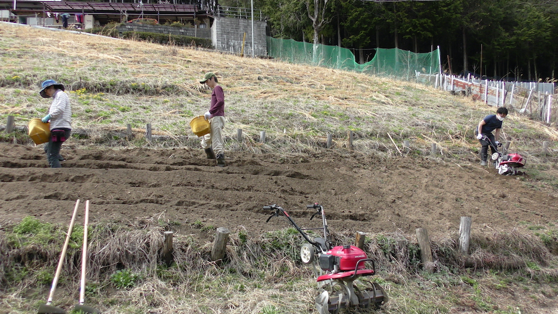
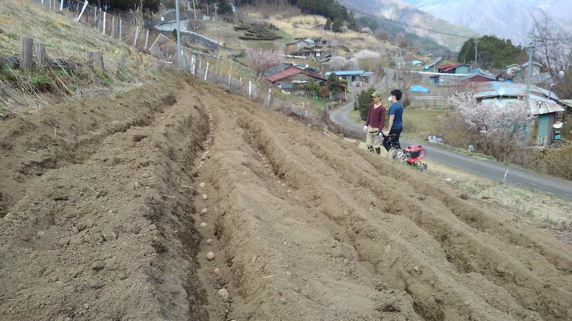

<ruby>麓<rp> (</rp><rt>ふもと</rt><rp>) </rp></ruby>ではすっかり暖かくなり、事務局からも連絡をいただいたので、下栗芋の植付けに行きました。

種芋は事前に消毒され、2週間くらいの日光浴で適度に芽を出しています。

今年は肥料も2週間前に撒いて、土に馴染ませてあります。化学肥料とはいえ、植えるのと同時に施肥するよりは栄養が届きやすいのでは? という、メンバーの提言です。

本当かどうかは、確かめる<ruby>術<rp> (</rp><rt>すべ</rt><rp>) </rp></ruby>がありません...

でも今後、有機肥料を使うようにしたい気持ちもありますので、事前撒きスケジュールで動いてみたのは良かったかもしれません。

作業はもう皆さん慣れたもので、耕起から畝作り、芋を並べるまで流れ作業のように進みます。

畝間を広め、株間を狭めと意識しました。
畝間は約60<abbr>cm</abbr>以上、株間は20〜25<abbr>cm</abbr>くらいになっていると思います。

畝間が狭いと、土寄せしにくくなります。
株間が広いと、芋が大きくなり下栗いもっぽさが無くなってしまいます。
さらには連続的に掘れないので、収穫にひと苦労でした。

これらの過去の知見を結集し、ざっくりと割り出された間隔が今年の植え方です!

今年は約15<abbr>kg</abbr>を植えました。
順調に育てば、70〜80<abbr>kg</abbr>の収穫が期待できます。

毎年、気候とか、虫とか、ウィルスとか、いろんな自然現象の影響を受けますので、コントロールなんてできないものだなぁと思います。

できるだけのことを、するだけです。

さて、あとは土を<ruby>被<rp> (</rp><rt>かぶ</rt><rp>) </rp></ruby>せるだけ。

なんか、随分とクネクネしてますけど。

これからも、修行を積みましょう。
